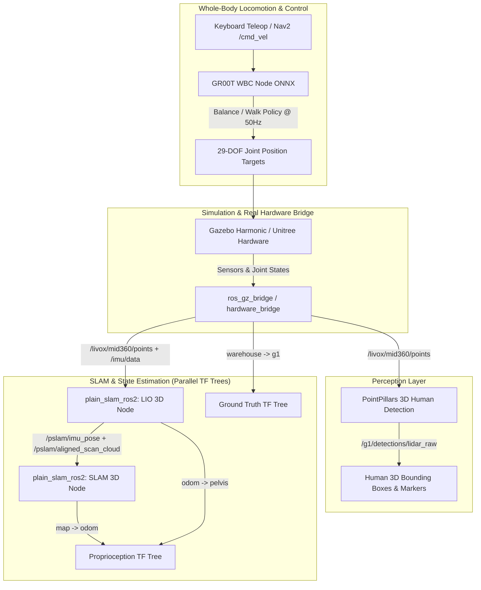

# G1 Perception & Navigation Stack — Project Tasks & Roadmap

This document outlines the architecture, package breakdowns, task status, and verification procedures for the Unitree G1 humanoid full-stack autonomy and perception system.

---

## 1. System Architecture Overview

---

## 2. Completed Tasks Summary

| Task ID | Component | Status | Description |
|---|---|---|---|
| **T1** | `g1_description` | ✅ Completed | 29-DOF URDF with Gazebo Harmonic ODE physics, joint gains, sensor frames, and RViz displays. |
| **T2** | `g1_bringup` | ✅ Completed | Launch system supporting simulation (`sim.launch.py`, `sim_teleop.launch.py`) and real robot deployment. |
| **T3** | `livox_detection` | ✅ Completed | PointPillars & CenterPoint PyTorch/CUDA 3D bounding box detection on raw Livox Mid-360 point clouds. |
| **T4** | `plain_slam_ros2` | ✅ Completed | 3D LiDAR-Inertial Odometry and Graph SLAM generating filtered global pointcloud maps. |
| **T5** | `g1_wbc` | ✅ Completed | GR00T ONNX whole-body balance and walk policy execution with stance holding and watchdog deadman. |
| **T6** | `g1_nav` | ✅ Completed | Interactive WASDQE keyboard teleoperation and Nav2 navigation stack integration. |
| **T7** | **Dual TF Graph** | ✅ Completed | Split ground-truth (`warehouse -> g1 -> gt_pelvis`) and proprioception (`map -> odom -> pelvis`) trees. |

---

## 3. Detailed Component Breakdown

### 3.1. Whole-Body Control & Balancing (`g1_wbc`)
- **Policies**: Uses `GR00T-WholeBodyControl-Balance.onnx` and `GR00T-WholeBodyControl-Walk.onnx`.
- **Zero-Velocity Idle**: When no command is active or $\|\text{cmd}\| \le 0.05\text{ m/s}$, the WBC strictly executes the standing balance policy with stance height set to $0.74\text{ m}$.
- **Joint Order & Gains**: Explicitly drives the 15 leg and waist joints with policy-trained PD gains (`kp` 40..250, `kd` 2..5) while maintaining the 14 upper-body arm joints at zero.

### 3.2. 3D Perception & Human Detection (`livox_detection`)
- **Backend**: PointPillars (`pointpillar_model.py`) optimized for CUDA inference on point clouds from `/livox/mid360/points`.
- **Target Frame**: Bounding box centers transformed to the `pelvis` frame and visualized via RViz markers on `/g1/detection_markers/livox`.

### 3.3. 3D SLAM & Odometry (`plain_slam_ros2`)
- **LIO 3D**: Processes `/livox/mid360/points` and `/imu/data` to compute high-frequency deskewed scans and odometry.
- **SLAM 3D**: Performs pose graph optimization and loop closures, publishing `/pslam/filtered_map_cloud` and `/pslam/lio_map_cloud`.

### 3.4. Dual Parallel TF Trees
- **Ground Truth**: `warehouse -> g1 -> gt_base_link -> gt_pelvis` (from Gazebo `PosePublisher`).
- **Proprioception / SLAM**: `map -> odom -> pelvis -> <robot_links> -> mid360_link -> livox_frame`.
- **Fixed Frame in RViz**: Defaulted to `map`.

---

## 4. Pending / Next Phase Tasks

- [ ] **T8.1: Human Following Controller**: Implement tracking node that consumes `/g1/detections/lidar_raw` and commands `/cmd_vel` to maintain a 1.0m standoff distance behind moving humans.
- [ ] **T8.2: Hardware Deployment Validation**: Run `full_real.launch.py` with physical Livox Mid-360 and Unitree G1 robot bridge.
