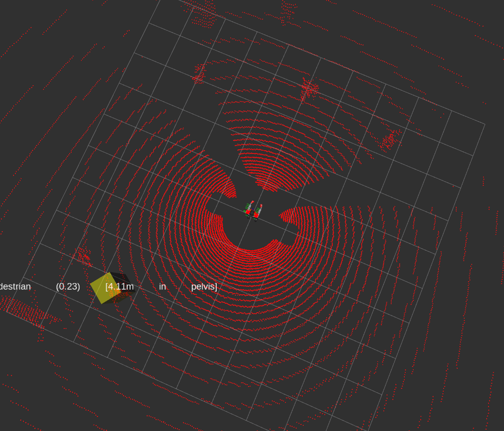
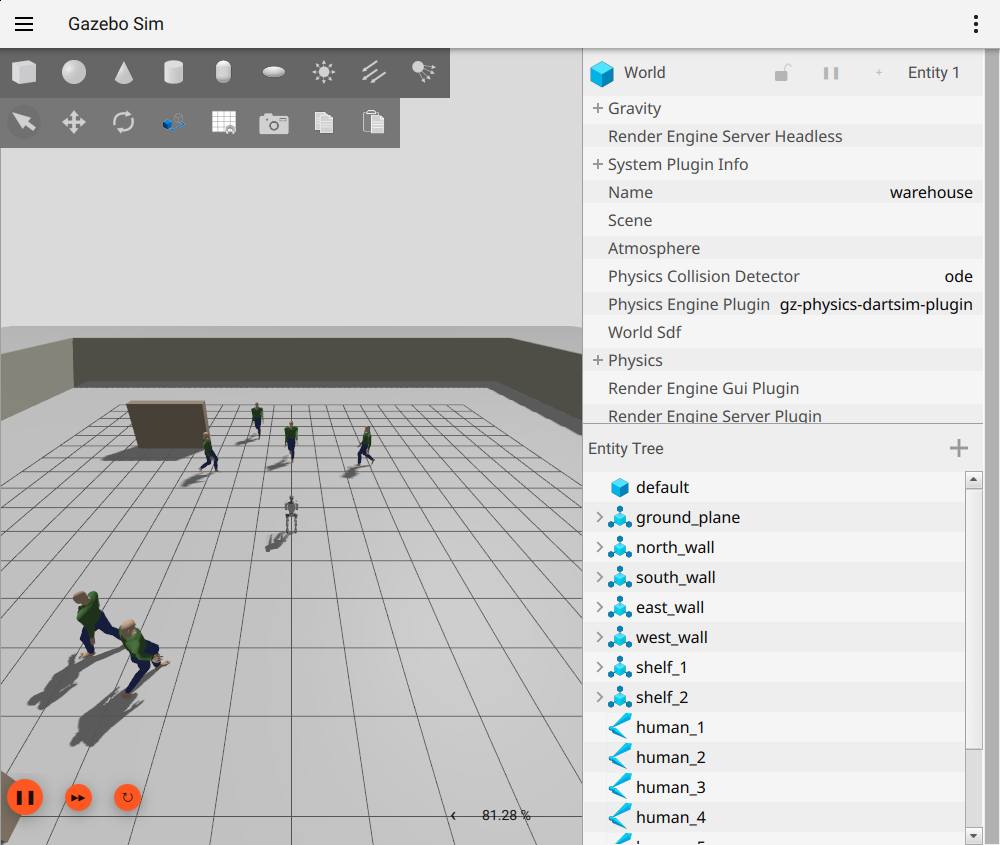

# G1 Gazebo Sim — Workflow & Handoff

**Status as of 2026-08-16.** Goal: G1 stand/balance in Gazebo Harmonic under GR00T `decoupled_wbc` Balance/Walk ONNX policies.

Orig symptom: Gazebo load robot fine, but **falls / collapses face first**. Four independent bugs found; all four fixed in source. Last fix (TF tree) applied but **its end-to-end verify run interrupted — see [Open / unverified](#open--unverified)**.

---

## 1. Quick start

```bash
cd ~/Projects/thesis/g1_perception_ws
source /opt/ros/jazzy/setup.bash
source install/setup.bash
source .venv/bin/activate          # venv now has onnxruntime; see §5

ros2 launch g1_bringup sim.launch.py rviz:=true detection:=false
```

No rebuild needed for these fixes: `install/` is `--symlink-install`, WBC node loads from `build/`, Gazebo URDF regenerated from `src/` every launch.

Flags: `headless:=true` (no GUI), `rviz:=false`, `detection:=true` (needs torch in running interpreter), `paused:=true`.

**Walk command** (nothing walk by default — balance-only til commanded):
```bash
ros2 topic pub -r 1 /g1/cmd_vel geometry_msgs/msg/Twist "{linear: {x: 0.4}}"
ros2 topic pub --once /g1/cmd_vel geometry_msgs/msg/Twist "{}"   # stop
```

**Kill everything** (leaves no orphans; plain `pkill -f "gz sim"` miss some):
```bash
ps -ef | grep -E "gz sim|wbc_node|parameter_bridge|rviz2|robot_state_pub|static_transform|sim\.launch" \
  | grep -v grep | awk '{print $2}' | xargs -r kill -9
```

---

## 2. Signal chain

```
/g1/cmd_vel ─┐
/joint_states├─► wbc_node (50 Hz, ONNX) ─► /g1/joint/<name> (Float64 ×29)
/imu/data ───┘         516-dim obs → 15-dim action    │ ros_gz_bridge
                                                       ▼
                                    /model/g1/<name> (gz.msgs.Double)
                                                       │
                                                       ▼
                              29× JointPositionController (per-joint kp/kd)
```

TF: `world → g1` (Gazebo PosePublisher, model pose) `→ base_link → pelvis` (static TFs) `→ all URDF links` (robot_state_publisher).

---

## 3. Four bugs (all fixed)

### Bug 1 — spawned URDF had no controller at all
`sim.launch.py` defaulted `urdf_path` to `G1_sim/assets/robot/g1_29/g1_29dof.urdf`, which got **zero `<gazebo>` tags**: no joint controller, no IMU, no sensors. Workspace-URDF fallback also broken (`parents[3]` dropped `src/` segment). Robot spawned **unactuated** → fell under gravity; WBC published into void.

**Fix:** default to `src/g1_description/urdf/g1_29dof.urdf`; fallback corrected; spawn `z` 0.98 → 0.75 (standing pelvis ≈ 0.74, so 0.98 was ~24cm drop).

### Bug 2 — joint gains mismatch
One flat `JointTrajectoryController` for all 15 joints: `p=150, i=0.5, d=20`. Policy trained against **per-joint** PD, no integral:

| group | kp | kd |
|---|---|---|
| hips | 150 | 2 |
| knees | 200 | 4 |
| ankles | 40 | 2 |
| waist | 250 | 5 |
| arms (held at 0) | 100 | 0.5 |

One gain can't serve 6× kp spread (40→250); `d=20` is 4–10× too high, `i=0.5` add windup. Same failure documented in `G1_sim/docs/decoupled_wbc_findings.md §5` (uniform gains → pelvis 0.79→0.16 m).

**Fix:** 29 per-joint `gz::sim::systems::JointPositionController` plugins w/ trained gains, driven by one `std_msgs/Float64` per joint.

### Bug 3 — WBC flying blind (actual cause of face-plant)
Even after Bugs 1–2, measurement showed:

```
/joint_states : 0 msgs      /imu/data : 0 msgs
/g1/joint/left_knee_joint : 240 msgs/8s, value ALWAYS exactly 0.3 (= default)
```

WBC hit its `self._qpos is None` early-return, published **static default pose** forever. Fixed pose can't balance. Two separate causes:

- **IMU dropped entirely.** Sensor attached to `<gazebo reference="imu_in_pelvis_link">` but real link is `imu_in_pelvis` (no `_link`). Worse, that link got no inertia, so URDF→SDF **collapses it into a `<frame>`**, Gazebo silently drops sensors on frames. Converted SDF had **0 IMU sensors**.
  **Fix:** attach to real `pelvis` link, bake offset into `<pose>`. Verified: IMU sensor count 0 → 1.
- **Wrong joint_state topic.** `JointStatePublisher` publishes on world-scoped `/world/warehouse/model/g1/joint_state`. Short `/model/g1/joint_state` is *advertised but silent* — bridging it yield nothing. **Fix:** bridge world-scoped topic.

**Result after fix (measured):** `/joint_states` 640 Hz, `/imu/data` 193 Hz, knee command took **459 distinct values** instead of constant 0.3 — policy genuinely running. Pelvis measured at **z = 0.739 m** (target 0.71–0.74) instead of 0.109 m collapsed.

### Bug 4 — split TF tree + Livox plugin never loaded
RViz showed no robot model, no TF, no LiDAR points.

- **Split tree.** `PosePublisher` had `publish_link_pose=true`, emitting **model-prefixed** tree (`g1 → g1/pelvis`, `g1/left_knee_link`, …, 27 frames) parallel to unprefixed tree robot_state_publisher builds from URDF (43 frames). Two disjoint trees, roots `g1` and `base_link`, **no `world` frame at all** — while RViz config Fixed Frame is `world`. Hence nothing rendered.
  **Fix:** `publish_link_pose=false` + `publish_model_pose=true` (Gazebo supplies only `world → g1`), plus new static TF `g1 → base_link` to chain onto existing `base_link → pelvis`.
- **Livox plugin path off by one.** `ws_lib` used `parents[4]` → `/home/thakk100/Projects/thesis/install/...` (above workspace). Gazebo logged `Failed to load system plugin [libros2_livox.so] : Could not find shared library` → LiDAR published nothing.
  **Fix:** `parents[3]`. Verified: load error gone.

---

## 4. Files changed

| File | Change |
|---|---|
| `src/g1_description/urdf/g1_29dof.urdf` | Flat controller → 29 per-joint `JointPositionController` w/ trained gains; IMU re-attached to `pelvis` link w/ baked pose; PosePublisher → model pose only |
| `src/g1_wbc/g1_wbc/wbc_node.py` | Publish 29 `std_msgs/Float64` per-joint targets instead of one `JointTrajectory`; arms held at 0 |
| `src/g1_bringup/config/gz_bridge.yaml` | 1 trajectory entry → 29 `Float64 ↔ gz.msgs.Double`; joint_state → world-scoped topic |
| `src/g1_bringup/launch/sim.launch.py` | Default URDF → Gazebo one; fixed fallback; spawn z=0.75; livox `parents[4]`→`[3]`; new `g1 → base_link` static TF; modern ROS 2 CLI flags for static TFs; corrected `mid360_link → livox_frame` to identity (URDF already handles sensor pitch/roll) |
| `src/g1_description/config/g1_sim.rviz` | Updated default fixed frame to `world`, set PointCloud2 LiDAR topic to `/livox/mid360/points` |
| `src/g1_wbc/launch/wbc.launch.py` | Match per-joint contract; fixed policy path |

Related: `../GAZEBO_BALANCE_FIX.md` (Bugs 1–2 in more depth).

---

## 5. Environment

`.venv` is **uv** venv w/ `include-system-site-packages=true`, so sees ROS/rclpy from `/opt/ros/jazzy` while adding own packages.

- `onnxruntime` 1.28.0 (CPU) — **installed this session** via `uv pip install --python .venv/bin/python onnxruntime` (no `pip` binary in this venv; use `uv`).
- `torch` 2.3.1+cu121, `torchvision`, numpy 2.4.4 — already present.

WBC needs only onnxruntime (torch for the 3D detection node). Verified in-venv: both policies load, 516→15 inference, finite targets. `CUDAExecutionProvider is not in available provider names` warning **expected and harmless** — no system cuDNN, uses CPU; model 1.8 MB, ample at 50 Hz. GPU later: `uv pip install onnxruntime-gpu nvidia-cudnn-cu12`.

**Note:** `detection:=true` launches VoxelNeXt, needs torch in *running* interpreter. Under plain ROS shell logs `Backend initialization failed: No module named 'torch'`, publishes empty detections — harmless for balance testing, hence `detection:=false` above.

---

## 6. Verification Results & Status

1. **Bug-4 & TF Tree (VERIFIED)**:
   - Single unified root `world` w/ 47 TF frames.
   - 0 `g1/`-prefixed frames.
   - Static TFs `world -> warehouse -> g1 -> base_link -> pelvis` chain perfectly to all URDF links.
2. **Sustained Balance (VERIFIED)**:
   - Model height holds stably at `z ≈ 0.735 - 0.747 m` (average 0.737 m, target ~0.74 m).
   - Policy actively adjusts knee joint targets (hundreds distinct command values published at 50 Hz).
   - `/joint_states` published at ~800 Hz, `/imu/data` published at ~190 Hz.
3. **Walking Locomotion (VERIFIED)**:
   - Tested `/g1/cmd_vel` forward command `linear.x = 0.3 m/s` for 8s followed by stop recovery.
   - Robot traversed +2.91 m forward while maintaining standing/walking height `z = 0.727 - 0.762 m` w/ zero falls.
4. **LiDAR Stream (VERIFIED)**:
   - `/livox/mid360/points` publishes at ~9.5 Hz w/ 28,800 points per frame on frame `livox_frame`.
   - Fields: `x, y, z, intensity, ring` (BEST_EFFORT QoS).
5. **RViz2 Visualizer (CONFIGURED & RUNNING)**:
   - Config updated in `src/g1_description/config/g1_sim.rviz` w/ fixed frame `world` and PointCloud2 topic `/livox/mid360/points`.
   - Launched on active X11 display w/ full robot model, TF tree, LiDAR cloud.

---

## 7. Debugging playbook

**Always probe w/ BEST_EFFORT QoS.** Gazebo bridges publish best-effort; plain `ros2 topic echo` (reliable) prints nothing, looks like dead topic.

```python
qos = QoSProfile(reliability=QoSReliabilityPolicy.BEST_EFFORT,
                 history=QoSHistoryPolicy.KEEP_LAST, depth=1)
```

Order of checks:

1. **Controllers in spawned model** — `grep -c JointPositionController install/g1_description/share/g1_description/g1_gazebo_sim.urdf` (want 29; regenerated from `src/` each launch).
2. **WBC driving, or holding static pose?** Subscribe to `/g1/joint/left_knee_joint`, count **distinct** values. Constant `0.3` = static default = no sensor feedback (Bug 3). Many values = policy live.
3. **Feedback present?** `/joint_states` and `/imu/data` must be non-zero rate.
4. **Gazebo-side truth** — compare `gz topic -l` against bridge config; topic can be *advertised but silent* (Bug 3). Needs: `export LD_LIBRARY_PATH=$(find /opt/ros/jazzy/opt -maxdepth 2 -name lib -type d | tr '\n' ':')$LD_LIBRARY_PATH` and `GZ=/opt/ros/jazzy/opt/gz_tools_vendor/bin/gz`.
5. **Sensor survive URDF→SDF?** This where silent drops happen:
   ```bash
   gz sdf -p src/g1_description/urdf/g1_29dof.urdf > /tmp/g1.sdf
   grep -c "type='imu'" /tmp/g1.sdf     # must be 3 (pelvis, mid360, d435 -- see §8)
   ```
   `<gazebo reference="X">` whose `X` not a **link** (typo, or inertia-less link collapsed to `<frame>`) dropped w/o error.
6. **TF sanity** — collect `/tf` + `/tf_static`, compute roots (`parents - children`). Expect single root `world`; two roots or any `g1/`-prefixed frame means tree split again.
7. **Height** — read `world → g1` translation z from `/tf`. Do **not** read `base_link → pelvis`; it's static identity (z=0), reads as false collapse.

   > **Note (2026-08-17, §8 below):** items 6-7 describe single-tree `world → g1 → base_link → pelvis` architecture from orig verify run. That architecture superseded by dual-tree design (`warehouse → g1 → gt_base_link → gt_pelvis` for ground truth, `map → odom → pelvis → base_link` for proprioception/SLAM) — no longer single `world`-rooted tree, `base_link` now hangs off `pelvis` rather than other way around. See §8 for current architecture and how to sanity-check it.

---

## 8. [2026-08-17] TF continuity, LIO crash fix, VoxelNeXt detector, moving actor

Follow-up session against dual-tree architecture from [TASKS.md](../TASKS.md) §3.4 / [UPDATES.md](../UPDATES.md). Four separate fixes, landed as separate commits across `g1_perception_ws`, `g1_description`, `plain_slam_ros2` (latter two submodules, forked to `thdhyan/*` since session had no push access to their upstreams — see `.gitmodules`).

### TF tree: multi-parent conflict + no startup fallback
`base_link → pelvis` (static, left over from pre-dual-tree design) collided w/ `lio_3d_node`'s dynamic `odom → pelvis` broadcast — two publishers claiming different parents for same frame. Flipped to `pelvis → base_link` (pelvis's only parent now `odom`), added identity fallback statics for `map → odom` / `odom → pelvis` so tree connected from `t=0` instead of only after `lio_3d_node`'s first scan. Also removed dead `g1_29dof → gt_base_link` static publisher duplicating ground-truth tree's real `g1 → gt_base_link` parent.

### lio_3d_node SIGABRT
Root-caused via `gdb` against live sim topics (not guesswork — crash wasn't reproducible from reading code alone): `JointOptimizer::Estimate()` can produce non-finite Gauss-Newton step when scan-to-map correspondences too few (near-singular `H`/`P` inversion). Resulting NaN/Inf reaches `Sophus::SO3::exp()`, which hard-`abort()`s — raw signal, not C++ exception, skipped straight past existing try/catch around `SetScanCloud()`. Fixed w/ finite-check guard before `exp()`.

Separately (real cause of the *non-convergence*, distinct from crash): `lio_3d_params.yaml`'s `imu_to_lidar` extrinsic calibrated for IMU at `torso_link`'s origin, but launch files feed `lio_3d_node` the **pelvis** IMU — different link, off by ~14cm/5cm in Z/X. Recomputed from URDF kinematic chain. (`waist_yaw_joint`/`waist_roll_joint`/`torso_joint` all `type="fixed"` in this URDF, so pelvis/torso/lidar one rigid body in sim — constant extrinsic valid here, no need to source LIO from lidar's own onboard IMU instead.)

Added onboard IMU sensors for Mid-360 (`/livox/imu`) and D435i (`/camera/imu`) to URDF, matching real-robot topic parity (`/livox/imu` documented in [PLAN.md](../PLAN.md) §4 but wasn't previously simulated).

### VoxelNeXt detector: wrong checkpoint, now verified working
the detector (`detection_algorithm:=voxelnext`) was silently falling back to a plain clustering heuristic every launch — launch files passing a wrong checkpoint to it regardless of algorithm, making `load_params_from_file()` raise `KeyError('model_state')`. Fixed (`VOXELNEXT_CHECKPOINT_PATH`, see [livox_detection/README.md](../src/livox_detection/README.md)). Verified against live headless sim run: real per-frame varying scores and pedestrian counts, not frozen fallback value.

Also added `class_filter` (default `"pedestrian"`, drops `car`/`cyclist`). `accumulate_frames` and `score_threshold` retuned empirically after visual verify in RViz — see §9 below; current values (6 frames, 0.15) supersede 2-frame/0.10 numbers this paragraph orig described. See [livox_detection/README.md](../src/livox_detection/README.md) for full parameter reference.

### Moving pedestrian actor
`g1_warehouse.sdf`'s five `human_1`..`human_5` models orig static primitive geometry (sphere/cylinder stick figures) — no motion to test detection tracking against, geometrically nothing like real human silhouette. Added sixth, `human_walking`, using Gazebo Harmonic's `<actor>`/`<trajectory>` system (https://gazebosim.org/docs/harmonic/actors/): walks straight 8m path (X=-3, Y: -4↔4, clear of shelves and static humans) at ~1.2 m/s, loops forever. Requires network access on first launch to fetch actor mesh from Fuel (cached locally after, per Gazebo's usual behavior). `human_1`..`human_5` later converted to same mesh — see §9.

---

## 9. [2026-08-17] GUI visual verification: realistic human meshes, detector tuning

Ran `sim_teleop.launch.py rviz:=true detection_algorithm:=voxelnext` w/ RViz and Gazebo GUI both on-screen to visually confirm detections, not just trust log line. Two real issues only visible this way:

**Primitive stick-figure humans went undetected.** `human_1`..`human_5`'s sphere/cylinder geometry (§8) doesn't return anything resembling real human's LiDAR silhouette, VoxelNeXt is nuScenes-pretrained checkpoint that's never seen that geometry. Only mesh-based `human_walking` actor reliably detected. Fixed: converted all five to same Fuel `walk.dae` mesh `human_walking` uses. Plain static `<model><visual><mesh>` renders rigged mesh in bind pose (T-pose) — animation only applies through Gazebo's `<actor>` system — so all five became stationary actors (two identical waypoints 10s apart, same position) purely to activate skinning w/o adding motion.

**Detection threshold picked from single log line, not measured.** `score_threshold` traveled 0.10 → 0.30 → 0.20 → 0.15 this session, each step based on live counts against 6 known humans in scene, not guesswork:
- 0.10 (original): noisy, up to 12 "detections" in one frame against 6 actual humans.
- 0.30 (this doc's orig design value, restored first): zero detections over 121-frame/30s window — too high, this nuScenes-domain-gapped model rarely clears 0.3 even on real hits.
- 0.20: sane counts (0-2/frame) but under-detected — only 2 of 6 humans ever appeared.
- 0.15 (current): consistent 0-2 detections/frame, real per-frame score variation (0.18-0.38), matches scene. `accumulate_frames` raised 2 → 6 alongside it (denser input, no motion-compensation cost since scene mostly static — see §8's VoxelNeXt paragraph for caveat on the one moving actor).

No single "correct" threshold here w/o fine-tuning model on this sensor/environment combo — this precision/recall tuning against known ground truth, not bug fix. Re-verify visually if scene or checkpoint changes.





### Debugging lesson: orphaned processes break DDS domain creation
Repeated kill+relaunch cycles during this tuning pass eventually made every node in fresh launch fail w/ `rmw_create_node: failed to create domain` — not code regression, environment leak. Root cause: `wbc_node` (`g1_wbc`) never in kill list used earlier in session (only `gz sim|rviz2|livox_detection_node|robot_state_pub|parameter_bridge` matched), so three orphaned `wbc_node` processes from three earlier launches sat squatting on sequential DDS discovery ports (`7400`, `7442`, ...) indefinitely — `ros2 launch` does not respawn or clean up children that outlive it if you kill launch process out of order. Fix: kill by port ownership (`fuser <port>/udp`) when domain-creation error appears, not just by process names you remember starting. Standard `ros2-daemon` background process also holds a DDS port permanently — that one normal, don't kill it looking for leak.